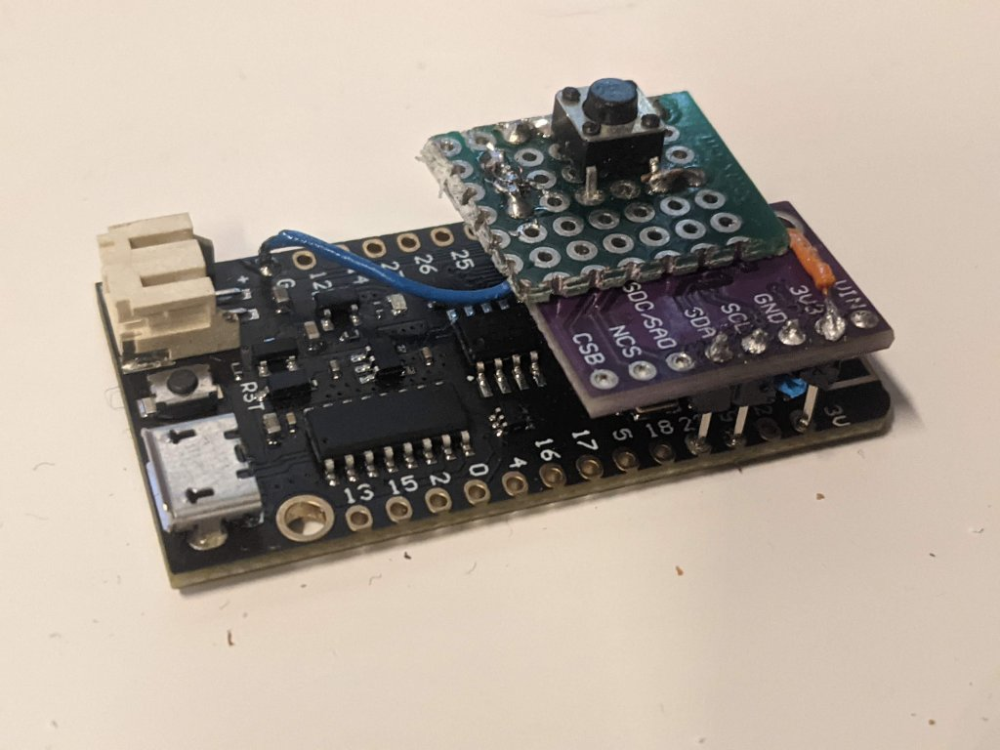
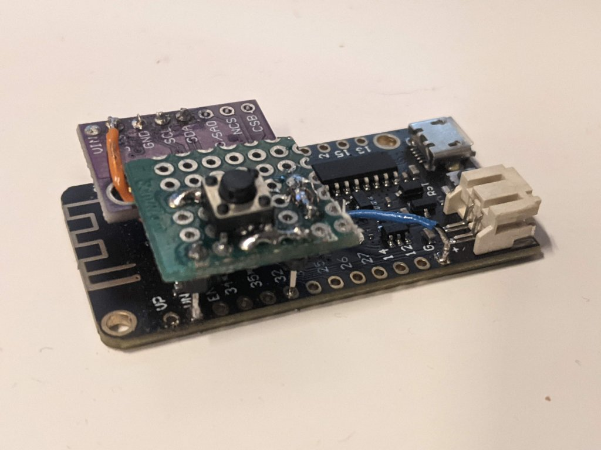
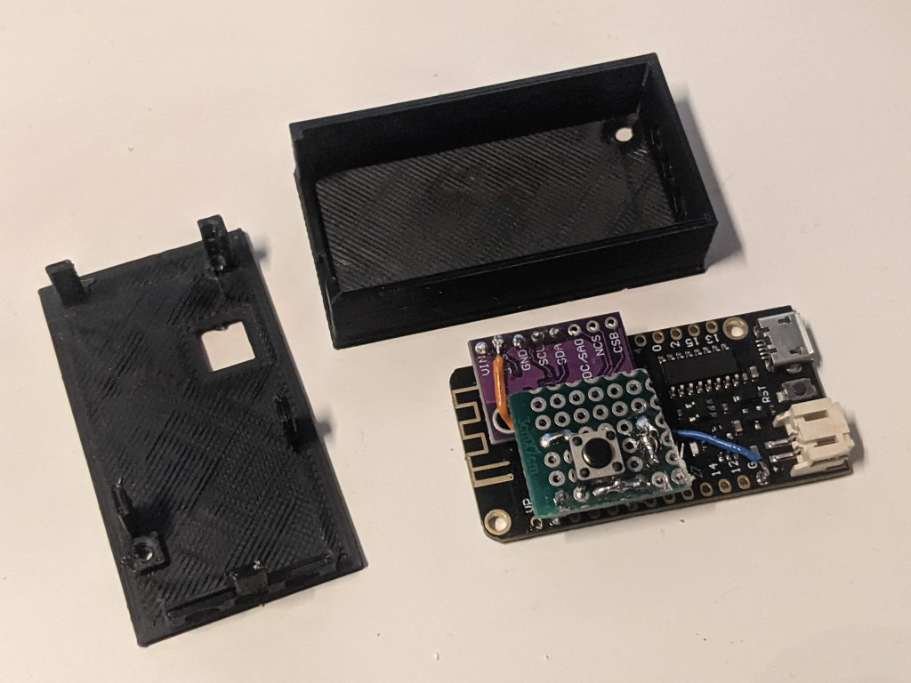

# BTMotionHeadTracker

A bluetooth gamepad using a MPU6050 on a ESP32 to track orientation.  
This project allow tracking head look in virtual simulators like in the following videos:
- [Arduino IMU head tracker v1.1 by moeburn](https://www.youtube.com/watch?v=CoO2gsCqq0Q)
- [Headtracking version 2: Arduino + IMU by Mathias Djärv](https://www.youtube.com/watch?v=QpO1Wty3F3I)

